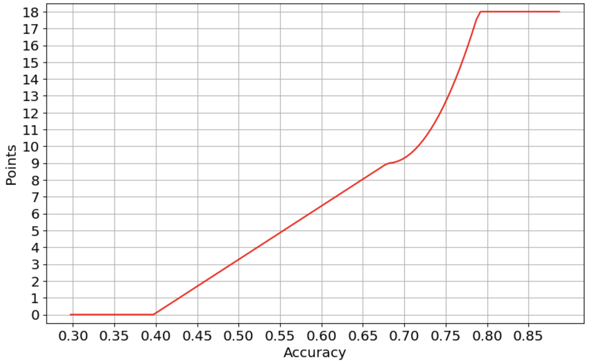

# Great Programming Challenge

This repository corresponds to a bonus challenge in my **Machine Learning** course at KTH : Kungliga Tekniska högskolan (en: Royal Institute of Technology). 

The challenge is to evaluate 10k data unlabeled (coming from EvaluateOnMe.scv) and we can use 1k data labeled (coming from TrainOnMe.csv). The objective is to get the best score possible, that's corresponds to get the best classifier.

> The number os point of the challenge depends on the accuracy of good results on the prediction as you can see on the next picture:

## Usage of code

There is like 2 modes: 

- the 'evaluate mode' to fit the model, predict the unlabeled data and print score into Solution.txt

- the 'searching mode' to search the best classifier using a partition of labeled dataset. Feel free to change values of hyperparameters, classifier etc.

To change mode of action you just have to switch the value of the variable ***searching_hyperparameter*** and modify the corresponding part as you want

> **/!\\   /!\\   /!\\** The default mode is the 'evaluate mode' but on a basic computer it take near 5 minutes to fit the classifier and predict labels. If you want a fast version, you can modify all ***n_estimators*** values to 10 for example

## Result

The result corresponds to the Solution.txt file. The rule of the challenge indicates that's the file needs to be a .txt extension and is the list of label.

The result will be evaluated after the submission of the challenge, so it's impossible to know the number of points before the 26th October. I estimate that my classifier has an accuracy between 0.789 and 0.805 (divising my labeled dataset into training and testing set). That could be nice to get that accuracy because this corresponds to the maximum of points. I will post the result when I will get it !

